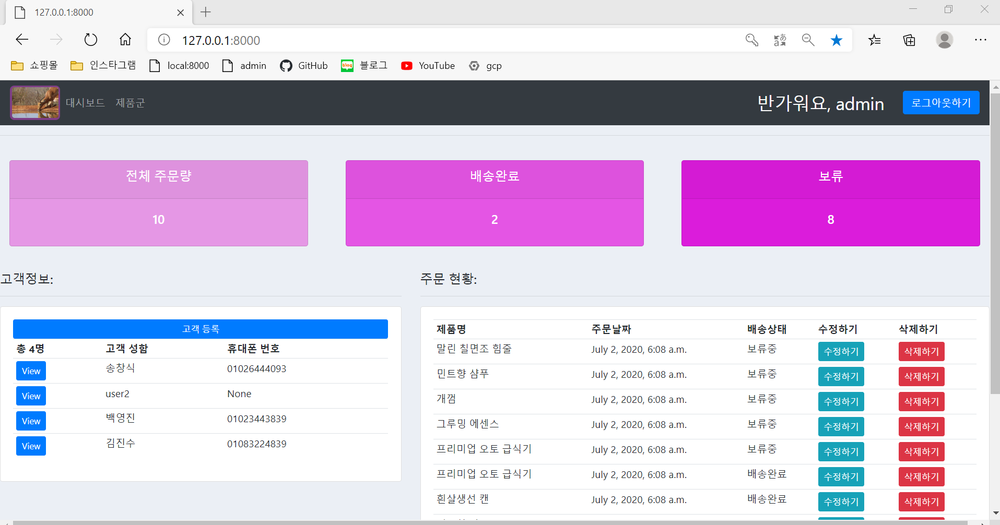
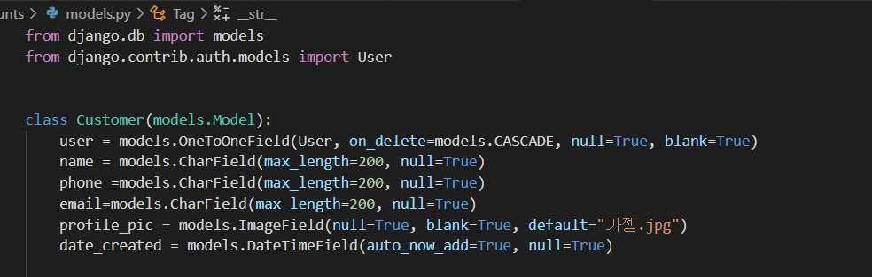
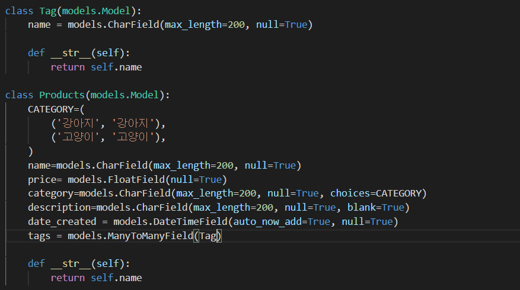
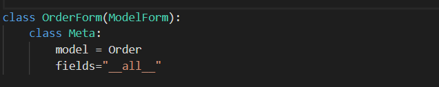
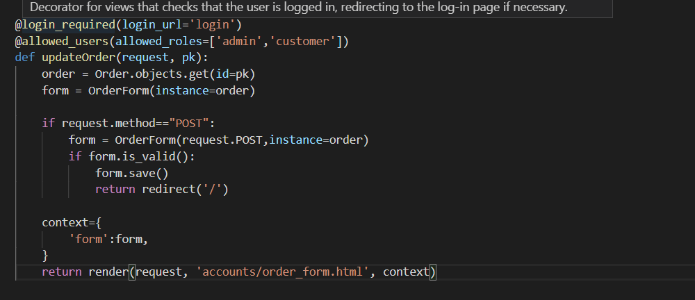
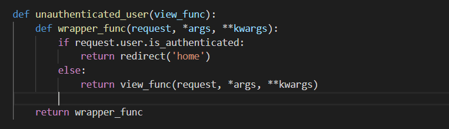
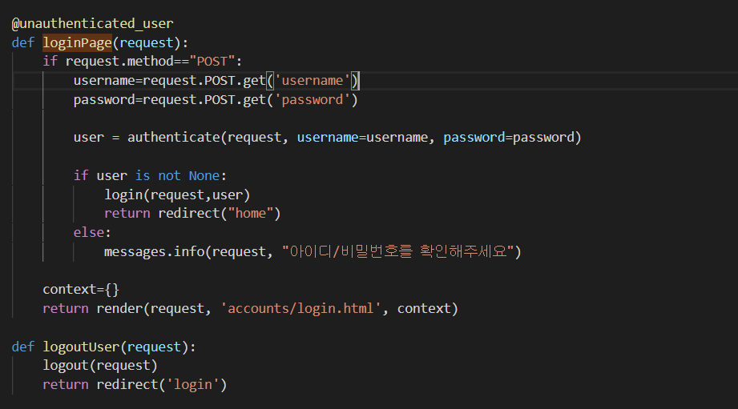
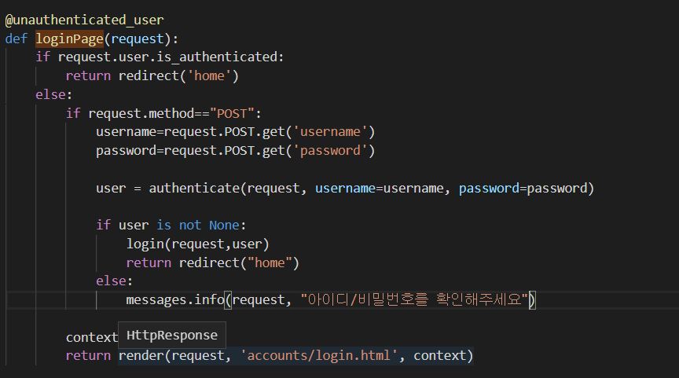
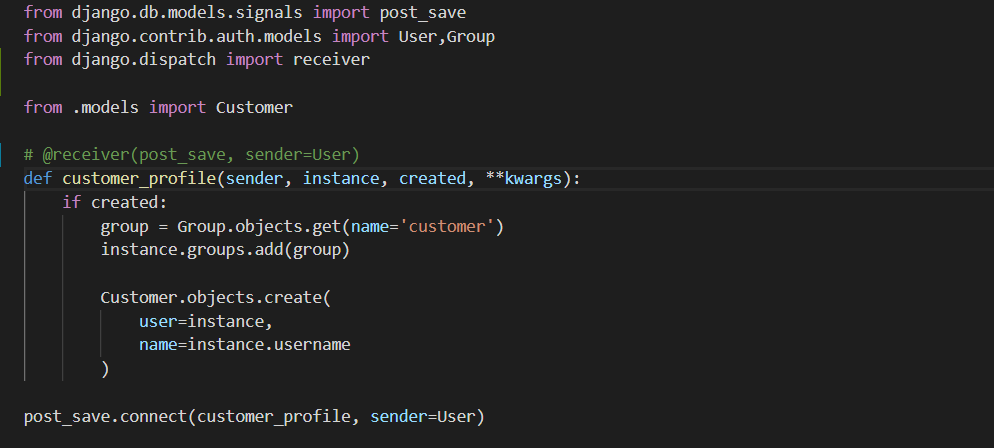
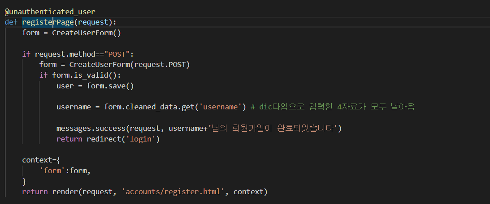

# 강아지, 고양이 반려용품 판매 사이트 제작 (http://34.64.204.254:8002)   

(관리자id/password -> admin/whdgus)   

> myshop 웹페이지는 반려견, 반려용품 판매 사이트 입니다  
관리자 레벨에서는 실시간으로 고객의 주문을 대시보드에서 관리/수정/삭제 할수있고  
고객은 원하는 물품을 주문하고 본인 Profile을 꾸밀 수 있습니다
### 필요한 기능
- 장고ORM을 이용한 기본적인 CRUD
- 관리자 모드와 일반사용자 모드를 나누어서 url을 변경해주고 template을 다르게 랜더링 해주기
- 위 사항을 views 로직 내에서 구현시에 코드 가독성, 중복 현상이 일어나므로 decorator를 이용하기
- 장고 시그널을 이용해 User모델에서 save()가 발동 되었을때 user의 소속 group을 정하고 1:1매칭 되어있는 Customer을 새로 생성해주기
- 각 고객들마다 개인 profile 설정 템플릿 만들기
- 장고 내장함수인 login/logout 이용해 로그인 로그아웃 템플릿만들기, 에러/성공 메세지 띄우기,bootstrap 이용해 간단한 디자인하기

# 모델 구성
> 총 4가지 모델을 만들었으며 1:1/1:다/다:다 관계를 장고 ORM으로 구현하였습니다  
  - Customer 모델의 user를 장고에서 기본제공하는 User모델과 1:1관계를 맺어 장고에서 제공하는 login/logout 세션관리를 이용해 개발기간을 단축시켰습니다  

  

  - 하나의 제품은 여러가지 태그를 가질수 있고 또 하나의 태그 또한 여러가지 제품군을 가지고 있을수 있습니다. ManyToMany필드를 통해 마이그레이션 하게되면 각각의 pk를 로우의 값으로 하는 테이블이 자동으로 생성됩니다
  
  
  
# 판매중인 아이템 CRUD 하기
  
    

  넷중에 상대적으로 어려운 기존의 값을 바꾸는 update뷰 입니다  
  주문 모델로 간단하게 form을 만드는 강력한 기능을 제공해주어서 템플릿단에서  
  POST메세지를 보냈을때 조건문으로 분기를시키고  
  POST자료와 기존 자료를 인자로해서 유효성 검사후 저장합니다
  POST자료만 받아서 save()를 실행 했을경우는 기존에 있던 자료를 그대로 놔두고 새로 생성하므로 덮어쓰기위해 POST자료와 원래 order를 모두 인자로 날려주어야 새로 db가 덮어써집니다
  
# decorator를 이용한 권한 설정
  
장고에서는 **login_required** 라는 데코레이터로 로그인 User테이블에 있는 사람으로 로그인 되어있지 않다면 자동으로 특정 url로 보낼수있는 데코레이터를 제공합니다  
비슷한 원리로 자기만의 decorator역시 만들수 있습니다
  
장고 user는 지금이 게스트상태인지 login상태인지를 알려주는 'is_authenticated' 인자를 가지고 있으므로 분기처리를 하여 이미 로그인된 사람은 redirect 함수로 다른곳으로 보내고 그 이외의 경우에는 본래 함수를 실행하게 합니다
  
다음과같이 login페이지에 login 되어있는 유저가 접근하려고하면 decorator함수로 인해서 바로 'home'으로 렌더링되게 됩니다  
  
위와 같이 데코레이터를 사용하지 않고 해당 로직을 views에서 처리할 수도 있지만 분기문 때문에 코드가 쓸데없이 지저분해지고 또 재사용하기가 번거롭게 됩니다

# 장고 signal을 사용해 이벤트 자동 처리하기
장고 signal이란 어떤 특정한 일을 수행할 때마다 signal이 발생하여 그 때에 지정한 동작을 수행할 수 있게 하는 신호(signal)를 발생하는 기능을 가지고 있습니다. User모델의 save()함수를 감지하는 post_save를 사용했습니다

   
장고 signal은 sender와 receiver로 구성됩니다 이번 프로젝트에서는 sender를 장고의 User모델로 지정해서 특정 행동인 user에서 save()함수를 발생시킬때마다 receiver인 customer_profile 함수가 실행되도록 하였습니다.  
여기서는 3개의 인자를 받았는데 sender는 User이고 instance는 저장된 객체를 가리킵니다 created는 새로 생성되었을때 참값을 가집니다.  

제 쇼핑몰에서 User의 save()함수는 회원가입창에서 발생합니다
  
form.save()함수가 실행된 후에(post) receiver인 customer_profile이 실행됩니다. 새로생성된 유저를 지정된 그룹에 넣고 1:1관계를 맺고있는 Customer 객체도 새로 생성해줍니다.

# 부족했던부분
- mysql을 몇주정도 배운기억이 있었기 때문에 db의 pk나 fk개념은 상대적으로 쉬웠습니다. 하지만 다:다 매칭이 어떤 식으로 이루어 지는지 mysql을 볼때도 몰랐는데, 이번에 새로 공부를 하면서 최대한 많은 예시를 보려고 했습니다 사람:취미, 사람:휴대폰기종, 학생:점수, 그리고 이번에 적용한 상품:태그 까지 예시를 보고나서 db browser라는 직접 테이블을 눈으로 볼수있는 툴을 받고나서 다대다 매칭할때 새로운 join테이블이 생기고 각 양쪽 테이블의 pk를 값으로 한다는것을 보고 이해하게 되었습니다

- 데코레이터 사용이 굉장히 힘들었습니다. 제가 책에서 봤던 데코레이터는 인자를 사용하지 않는 가장 단순한 형태의 데코레이터였고 그것도 @를 사용하는 데코레이터 형태가 아니라 실제 함수의 인자를 함수 주소값을 보내는 풀어쓴 형태를 한참보고 이해를 했던 상황이라 이번 프로젝트 진행중에 인자도 같이보내는 데코레이터/ 2중 데코레이터가 나와서 이해하는데 쉽지가 않았습니다. 구글링에서 예제를 찾아보다가 인도인이 설명해주는 인자 두개를 받는 나눗셈 예제에서 인자 두개중 항상 작은값으로 나누는 예시와 함께 데코레이터를 설명해주었고 인자 두개중 작은 값을 찾아 내는것 자체가 if문을 사용하는 조건절이었습니다. 이번 프로젝트에서도 데코레이터가 로그인 유/무를 따지는 분기문 이었기때문에 데코레이터를 쓰지 않았을때 굉장히 지저분해지는 코드를 보고 데코레이터 로직을 이해하는것에 추가하여 또한 왜 데코레이터를 사용해야 하는지 이유까지 알게 되었습니다

- GCP로 배포할때 장고 세팅에서 ALLOWED_HOSTS 설정할때 쉽지 않았습니다. 리눅스는 물론이고 cmd도 거의 만져본적이 없었기 때문에 명령어도 하나하나 찾아가며 자료를 옮기는 방법도 처음에는 filezilla를 이용하다가 github를 사용하게 되었고 안정적으로 자료를 옮길수 있게 되었습니다. 다만 아직 pull,push와 브랜치기능을 잘 몰라서 더 공부해야겠다고 생각합니다.

# 추가하고싶은부분

- 각 제품마다 detail 템플릿 구성하기(외부자료는 media 폴더이용하기)

- django와 nginx를 결합하기

- requirement.txt로 모듈관리 하는방법은 알았지만 docker로 환경구성하여 배포하기

- django getting start에서 tests를 활용해서 스스로 조건을걸어서 OK사인을 받는 기능을 사용해봤는데 이번 프로젝트에도 tests를 추가해보고 싶습니다
